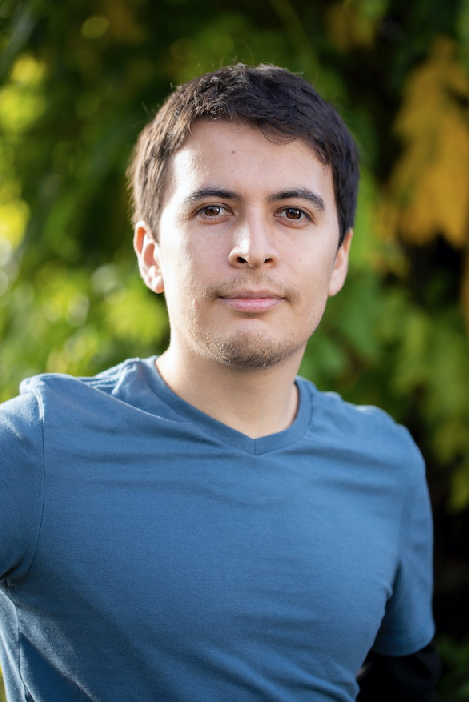
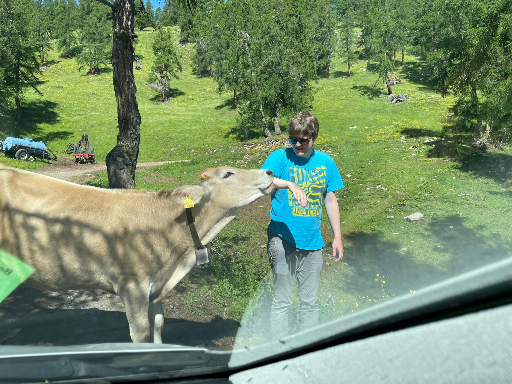

    <h2>Dr. Pengjuan Zu 祖鹏娟(PI)</h2>
    

        
    

    

        
I am interested in understanding the evolutionary and ecological processes of the chemical communication between plants and insects by integrating concepts from biology, chemistry and information theory.

        

            
 Assistant Professor, University of Neuchatel  (2025 - ) 

            
<b>Current position</b>: SNSF PRIMA Group leader (2021 - ) 

            
<b>2012 - 2017 PhD </b>: University of Zurich, Switzerland 

            
<b>2009 - 2011 MSc </b>: Uppsala University, Sweden 

            
<b>2005 - 2009 BSc </b>: Beijing Normal University, China 

        

    

 

<h2> Jérôme Cavailles (Postdoc researcher)</h2>

    

    
    
 I am interested in developing theoretical frameworks to better understand ecosystem dynamics. In particular, I apply information theory to study species interactions and ecological networks. By using mathematical models to formalize ecological processes and the flow of information within these networks, I aim to explore the principles governing self-organization, resilience, and adaptation in ecology and beyond.
 
    
<a href="https://interactionintegration.org">My Blog</a>

 

<h2>Roberto Rebollo H.(PhD student, 2021.11 - )</h2>

    

    
    
 My main interests are plant-insect interactions, chemical communication and community ecology. I conduct fieldwork in alpine meadows in eastern Switzerland, characterise the chemical traits of plants, and study how chemical traits shape interaction networks. 

 

<h2>G. Kofi Ahadjie (PhD student, 2025.04 - )</h2>

    

    
    
 My research interests broadly lie in the ecology and evolution of multi-trophic interactions. In pursuit of this, I have studied how chemo-ecologically mediated cues shape the behaviour and physiology of interacting plants and insects, and how these cues influence host selection and specialization in herbivores, pollinators, and their natural enemies. Currently, my research focuses on chemical communication between plants and insects in agricultural ecological communities, combining both empirical and theoretical approache 

 

<h2>Subidsha Gnanaseelan (Master student, 2025 - )</h2>

    

    
    
 Flower-bumblebee interactions in urban areas 

 

<h2> Eleonora Maccanelli (Bachelor student, 2025 - )</h2>

    

    
    
  

 

<h2> Victor Kuznetsov (Civil Service, 2025.04.28 - )</h2>

    

    
    
  

 

<h1>Alumi</h1>

<h3>Dr. Yan Yang (Postdoc, 2022 - 2024)</h3>

    

    
My research focuses on the chemical ecology and plant-insect interactions. I study the patterns and aim to understand the underlying processes of plant-insect communication in various habitats (e.g., Alpine grassland, tropical/subtropical forests, agricultural fields). I hope to bring new insights on plant-insect network and further contribute to biodiversity conservation and restoration practices.

    

 

Lea Stern (Bachelor student, 2023-2024)

 

    
 

 
    
    
 My bachelor thesis addresses the question about how flower nectar sugars of alpine grassland communities in Switzerland are influenced by the pollinators, their phylogenetic relationship and the environmental factor (altitude).

 

 

Dominic Stalder (Master student, 2022)

    
 

Flurina Zahn (Bachelor student, 2023)

 

    
 

 
    
    

 

 

