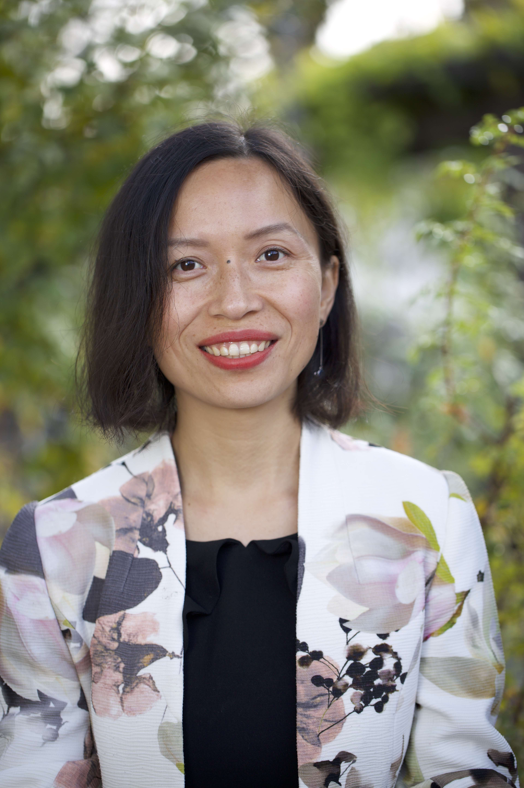

## Dr. Pengjuan Zu 祖鹏娟(PI)

I am interested in understanding the evolutionary and ecological processes of the chemical communication between plants and insects by integrating concepts from biology, chemistry and information theory.

## Roberto H. Rebollo (PhD student)

## Dr. Yan Yang (Postdoc)

## Flurina Zahn (Bachelor student)

-----
Past Students

Dominic Stalder (Master student, 2022)

