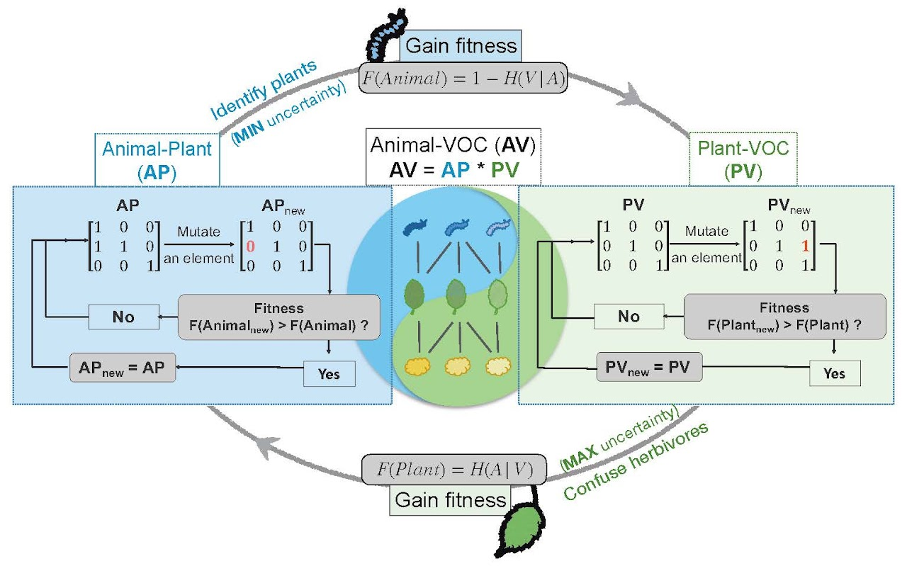

## Paper highlight

**Information arms race explains plant-herbivore chemical communication in ecological communities**

Zu P\*, Del-Val E, Boege K, Schuman M, Stevenson P, Alejandro Zaldivar-Riveron, Saavedra S. 2020 ***Science***    
DOI: 10.1126/science.aba2965 

Abstract:

Plants emit an extraordinary diversity of chemicals, providing information about their identity and mediating interactions with insects. However, most studies have focused on a few model species in controlled environments, limiting our capacity to understand plant-insect chemical communication in ecological communities. Here, by integrating information theory with ecological and evolutionary theories, we show that a stable information structure of plant volatile organic compounds (VOCs) can emerge from a conflicting information process between plants and herbivores. We corroborate this information arms-race theory with field data recording plant-VOC associations and herbivore-plant interactions in a tropical dry forest. We reveal that plant VOC redundancy and herbivore specialization can be explained by a conflicting information transfer. Information-based communication approaches can increase our understanding of species interactions across trophic levels.

<[Full paper](https://www.dropbox.com/s/m7zgehtp6ybzors/Zu_etal_2020_Science.pdf?dl=0)>		<[Perspective by Ricard Solé](https://www.dropbox.com/s/hjdy334tc5ciak9/Sole_2020_Perspectivel.pdf?dl=0)> <[Science](https://www.science.org/doi/10.1126/science.abc6344)>

## Peer Reviewed Papers
### 2022
**Zu, P.***, Garcia-Garcia, R., Schuman, M., Saavedra, S. and Melian, C. 2022. Plant-insect chemical communication in ecological communities: an information theory perspective. ***Journal of Systematics and Evolution***. [link](https://doi.org/10.1111/jse.12841)

Schwery, O*., Sipley, B., Braga, M. P., **Yang, Y.**, **Rebollo, R.**, & **Zu, P.\***. 2022. Plant Scent and Plant‐Insect Interactions–Review and Outlook from a Macroevolutionary Perspective. ***Journal of Systematics and Evolution***. [link](https://doi.org/10.1111/jse.12933)

Saavedra, S.*, Bartomeus, I., Godoy, O., Rohr, R.P. and **Zu, P.** 2022. Towards a system-level causative knowledge of pollinator communities. ***Philosophical Transactions of the Royal Society B*** 377(1853). [link](https://doi.org/10.1098/rstb.2021.0159)

### 2021
JX. Fang, HC. Du, X. Shi, SF. Zhang, F. Liu, Z. Zhang, **P. Zu**, and XB. Kong. 2021. Monoterpenoid signals and their transcriptional responses to feeding and juvenile hormone regulations in bark beetle Ips hauseri Reitter. ***Journal of Experimental Biology*** 224(9):jeb238030  [link](https://journals.biologists.com/jeb/article/224/9/jeb238030/238114/Monoterpenoid-signals-and-their-transcriptional)

**Zu, P.**, Koch, H., Schwery, O., Pironon, S., Phillips, C., Ondo, I., Farrell, I., Nes, W.D., Moore, E., Wright, G., Farman, D.I., and Stevenson PC. 2021. Pollen sterols are associated with phylogeny and environment but not with pollinator guilds. ***New Phytologist*** [link](https://nph.onlinelibrary.wiley.com/doi/10.1111/nph.17227)

### 2020
**Zu P**\*, Del-Val E, Boege K, Schuman M, Stevenson P, Alejandro Zaldivar-Riveron, Saavedra S. 2020. Information arms race explains plant-herbivore chemical communication in ecological communities.  ***Science***. [link](https://www.science.org/doi/10.1126/science.aba2965)

**Zu P**, Schiestl FP, Li X, Runcie DE, Gervasi D, Guillaume F*. 2020. Floral signals evolve in a predictable way under artificial and pollinator selection in Brassica rapa. ***BMC Evolutionary Biology*** 20(1), 1-12. [link](bmcevolbiol.biomedcentral.com/articles/10.1186/s12862-020-01692-7)

### - 2020
**Zu P**\*, Schiestl FP. 2017. The effects of becoming taller: Direct and pleiotropic effects of artificial selection on plant height in Brassica rapa. ***The Plant Journal*** 89, 1009-1019. [link](http://onlinelibrary.wiley.com/doi/10.1111/tpj.13440/full)

**Zu P**, Blanckenhorn WU, Schiestl FP*. 2016. Heritability of floral volatiles and pleiotropic responses to artificial selection in Brassica rapa. ***New Phytologist*** 209(3): 1208-1219. [link](http://onlinelibrary.wiley.com/doi/10.1111/nph.13652/full)

Cai J, **Zu P**, Schiestl FP*. 2016. The molecular bases of floral scent evolution under artificial selection: insights from a transcriptome analysis in Brassica rapa. ***Scientific Reports*** 6: 36966. [link](http://www.nature.com/articles/srep36966)

Sletvold N*, Grindeland JM, **Zu P**, Ågren J. 2012. Strong inbreeding depression and local outbreeding depression in the rewarding orchid Gymnadenia conopsea. ***Conservation Genetics*** 13(5): 1305-1315. [link](http://link.springer.com/article/10.1007/s10592-012-0373-7)