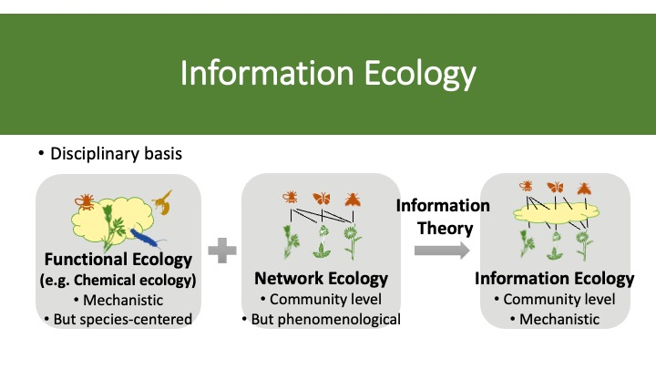

## Main Theme

Chemical communication is an ancient and ubiquitous channel to mediate species interactions (e.g., attracting, deterring) and plays important roles in connecting species, building interaction networks and affecting ecological services and functioning. Communication concerns signal transfer from senders to receivers and results in a fitness change for both parties. Moreover, a signal can also be eavesdropped upon by a third party, benefitting the eavesdropper without clear benefits for the sender. So far, most studies on chemical communication have focused on specific species isolated from whole ecological networks. In fact, deciphering community-level chemical communication is currently hampered by the lack of practical methodologies that would effectively scale up the number of interacting species without being overwhelmed by enormous amount of chemical information they produce, and more crucially, by the lack of testable conceptual theories.

The **Information Ecology** group aims to scale up the mechanistic understanding of species interactions from species to community level by integrating information theory into eco-evolutionary theories. The work combines empirical and theoretical aspects, and aims to deliver novel insights on how to improve ecosystem stability and sustainability under global changes.
 

## Research topics
### (I) Chemical communication between plants and pollinators in apine grassland communities

Alpine grasslands are species rich communities and provide valuable resources for alpine pollinators. However, global warming may strongly affect the diversity of plants and insects and their interaction networks. This project aims to study the patterns of chemical communications in plant-insect networks and develop a novel theoretical framework to tackle the roles of chemical information in mediating species interactions in ecological communities and how they may get affected by climate changes. 

We use field sites of alpine grasslands at different elevations at the Calanda (Graubünden, Switzerland).  

#### Fieldwork includes: 
- Flower scent collection
- Flower color measurement
- Pollen and nectar collection 
- Plant-pollinator network construction

### (II) Do pollen nutrients constrain the diet of wild bees in urban areas? 
Collaborator: Dr. Marco Moretti, Dr. Joan Casanelles, WSL 

Pollen is nutrient-rich diet for wild bees. However, the situations of urbanization where there are a mixture of native and exotic floral resources, may threaten the dietary and nutritional requirement of wild bees. In this project, we study the effects of pollen nutrients on the diet of wild bees in urban areas in Europe.

### (III) Flower traits and pollination network of buckwheat 
Collaborator: Prof. Bruno Studer, Fabian Hess

Buckwheat has a long history of human cultivation, resulting in hundreds of breeding lines all over the world. It is a nutritional rich crop and its flowers provide important resources (incl. nectar and pollen) for diverse pollinators. This project aims to study the importance of flower traits in mediating plant-pollinator network in various important breeding lines of buckwheat. 

